# Pediafor Assessment Platform - Comprehensive Architecture

[](.)
[](.)
[](.)
[](.)
[](.)
[](.)
[](.)
[](.)

## Table of Contents

1. [Executive Summary](#executive-summary)
2. [Architecture Overview](#architecture-overview)
3. [Event-Driven Architecture](#event-driven-architecture)
4. [System Components](#system-components)
5. [Service Communication](#service-communication)
6. [Data Architecture](#data-architecture)
7. [Security Architecture](#security-architecture)
8. [Deployment Architecture](#deployment-architecture)
9. [Network Architecture](#network-architecture)
10. [Development Architecture](#development-architecture)
11. [Operational Architecture](#operational-architecture)

---

## Executive Summary

The Pediafor Assessment Platform implements a **event-driven microservices architecture** designed for educational assessment management. The platform provides a scalable, secure, and maintainable solution for creating, managing, grading, and analyzing educational assessments with real-time processing capabilities.

### Core Architectural Principles

- **Service Independence**: Each microservice owns its data and business logic
- **Event-Driven Communication**: RabbitMQ-powered asynchronous messaging between services
- **Database per Service**: No shared databases, ensuring loose coupling
- **API Gateway Pattern**: Single entry point with centralized authentication
- **Token-Based Security**: Stateless authentication using PASETO V4 tokens
- **Container-First Design**: Docker containers with orchestration-ready configuration
- **Test-Driven Quality**: High test coverage across all services with comprehensive test suites

### Platform Capabilities

- ✅ **User Management**: Registration, authentication, profile management with event publishing
- ✅ **Assessment Creation**: Rich assessment builder with media support and event-driven analytics
- ✅ **File Management**: Multi-format media upload with processing
- ✅ **Role-Based Access**: Student, Teacher, Admin permission levels
- ✅ **Submission Handling**: Complete student submission workflow with event publishing
- ✅ **Autosave & Draft Management**: Real-time answer saving and submission status
- ✅ **Event-Driven Architecture**: Complete RabbitMQ integration with user lifecycle and assessment events
- ✅ **Automated Grading**: Production-ready MCQ grading engine with event processing
- ✅ **Container Deployment**: Full Docker support with health monitoring
- ✅ **Gateway Service**: API Gateway with PASETO authentication
- ✅ **Frontend Application**: Complete React/Next.js interface with role-based dashboards
- 🔄 **AI Question Generation**: Next phase development (infrastructure ready)

---

## Architecture Overview

### High-Level System Architecture

```mermaid
graph TB
    subgraph "External Clients"
        WEB[🌐 Web Portal<br/>React/Vue/Angular]
        MOBILE[📱 Mobile Apps<br/>iOS/Android/Flutter]
        API[🔌 External APIs<br/>Third-party Integrations]
        ADMIN[👨‍💼 Admin Dashboard<br/>Management Interface]
    end
    
    subgraph "Load Balancer & Security"
        LB[⚖️ Load Balancer<br/>NGINX/CloudFlare]
        FIREWALL[🛡️ Security Layer<br/>Rate Limiting/DDoS Protection]
    end
    
    subgraph "API Gateway Layer"
        GATEWAY[🚪 Gateway Service<br/>Port 3000<br/>✅ Production Ready<br/><br/>🔐 PASETO Authentication<br/>🔄 Service Discovery<br/>📊 Request Routing<br/>⚡ Rate Limiting<br/>🔒 CORS Management<br/>📈 Health Monitoring]
    end
    
    subgraph "Core Microservices"
        direction TB
        
        USER[👤 User Service<br/>Port 4000<br/>✅ Production Ready<br/><br/>👥 User Management<br/>🔐 Authentication<br/>🎯 Token Generation<br/>👨‍🎓 Role Management<br/>📧 Profile Management<br/>📡 Event Publishing]
        
        ASSESSMENT[📝 Assessment Service<br/>Port 4001<br/>✅ Production Ready<br/><br/>📊 Assessment CRUD<br/>🎯 Question Management<br/>🖼️ Media Handling<br/>📋 Template System<br/>📅 Publishing Control]
        
        SUBMISSION[📤 Submission Service<br/>Port 4002<br/>✅ Production Ready<br/><br/>✍️ Answer Collection<br/>💾 File Uploads<br/>⏰ Auto-save<br/>📝 Draft Management<br/>✅ Submission Tracking]
        
        GRADING[🎯 Grading Service<br/>Port 4003<br/>✅ Production Ready<br/><br/>🤖 Auto-Grading<br/>📊 Score Calculation<br/>📈 Analytics Engine<br/>🔍 Performance Analysis<br/>📋 Report Generation]

        REALTIME[⚡ Realtime Service<br/>Port 8080<br/>✅ Production Ready<br/><br/>🔌 WebSocket<br/>🚀 WebTransport<br/>📡 Real-time Events]
    end
    
    subgraph "Future Services"
        ANALYTICS[📊 Analytics Service<br/>🔄 Development<br/><br/>📈 Usage Metrics<br/>📊 Performance Insights<br/>🎯 User Behavior<br/>📋 Custom Reports]
        
        NOTIFICATION[🔔 Notification Service<br/>🔄 Planned<br/><br/>📧 Email Alerts<br/>📱 Push Notifications<br/>💬 In-app Messages<br/>⏰ Scheduled Reminders]
        
        AI[🤖 AI Service<br/>🔄 Future<br/><br/>🎯 Question Generation<br/>📝 Auto-feedback<br/>🔍 Plagiarism Detection<br/>📊 Predictive Analytics]
    end
    
    subgraph "Data Storage Layer"
        direction LR
        DB1[(🗄️ User Database<br/>PostgreSQL 15<br/>Port 5432)]
        DB2[(🗄️ Assessment Database<br/>PostgreSQL 15<br/>Port 5433)]
        DB3[(🗄️ Submission Database<br/>PostgreSQL 15<br/>Port 5434)]
        DB4[(🗄️ Grading Database<br/>PostgreSQL 15<br/>Port 5435)]
    end
    
    subgraph "Cache & Message Layer"
        REDIS[(⚡ Redis Cluster<br/>Port 6379)]
        QUEUE[📨 RabbitMQ Message Broker<br/>Port 5672/15672<br/>✅ Production Ready]
    end
    
    subgraph "File Storage"
        STORAGE[🗂️ File Storage<br/>AWS S3/Azure Blob]
    end
    
    subgraph "Monitoring & Logging"
        METRICS[📊 Metrics<br/>Prometheus/Grafana]
        LOGS[📝 Centralized Logging<br/>ELK Stack]
    end
    
    %% External connections
    WEB --> LB
    MOBILE --> LB
    API --> LB
    ADMIN --> LB
    
    %% Security layer
    LB --> FIREWALL
    FIREWALL --> GATEWAY
    
    %% Gateway routing
    GATEWAY --> USER
    GATEWAY --> ASSESSMENT
    GATEWAY --> SUBMISSION
    GATEWAY --> GRADING
    GATEWAY --> REALTIME
    
    %% Database connections
    USER --> DB1
    ASSESSMENT --> DB2
    SUBMISSION --> DB3
    GRADING --> DB4
    
    %% Cache connections
    GATEWAY --> REDIS
    USER --> REDIS
    ASSESSMENT --> REDIS
    SUBMISSION --> REDIS
    GRADING --> REDIS
    
    %% File storage
    ASSESSMENT --> STORAGE
    SUBMISSION --> STORAGE
    
    %% Inter-service communication
    SUBMISSION -.-> ASSESSMENT
    GRADING -.-> SUBMISSION
    GRADING -.-> ASSESSMENT
    ANALYTICS -.-> USER
    ANALYTICS -.-> ASSESSMENT
    ANALYTICS -.-> SUBMISSION
    ANALYTICS -.-> GRADING
    
    %% Message queue
    USER --> QUEUE
    ASSESSMENT --> QUEUE
    SUBMISSION --> QUEUE
    GRADING --> QUEUE
    REALTIME --> QUEUE
    NOTIFICATION -.-> QUEUE
    
    %% Monitoring
    GATEWAY --> METRICS
    USER --> METRICS
    ASSESSMENT --> METRICS
    SUBMISSION --> METRICS
    GRADING --> METRICS
    REALTIME --> METRICS
    
    GATEWAY --> LOGS
    USER --> LOGS
    ASSESSMENT --> LOGS
    SUBMISSION --> LOGS
    GRADING --> LOGS
    REALTIME --> LOGS
    
    classDef production fill:#d4edda,stroke:#28a745,stroke-width:3px,color:#000
    classDef development fill:#fff3cd,stroke:#ffc107,stroke-width:2px,color:#000
    classDef planned fill:#f8d7da,stroke:#dc3545,stroke-width:2px,color:#000
    classDef database fill:#e2e3e5,stroke:#6c757d,stroke-width:2px,color:#000
    classDef infrastructure fill:#d1ecf1,stroke:#17a2b8,stroke-width:2px,color:#000
    
    class GATEWAY,USER,ASSESSMENT,SUBMISSION,GRADING,REALTIME production
    class ANALYTICS development
    class NOTIFICATION,AI planned
    class DB1,DB2,DB3,DB4,REDIS,QUEUE,STORAGE database
    class LB,FIREWALL,METRICS,LOGS infrastructure
```



### Service Interaction Flow

```mermaid
sequenceDiagram
    participant C as 🖥️ Client
    participant G as 🚪 Gateway
    participant U as 👤 User Service
    participant A as 📝 Assessment Service
    participant S as 📤 Submission Service
    participant Gr as 🎯 Grading Service
    participant RT as ⚡ Realtime Service
    participant DB as 🗄️ Database
    participant Cache as ⚡ Cache
    
    Note over C,Cache: Complete Assessment Workflow
    
    %% Authentication
    C->>G: 1. Login Request
    G->>U: 2. Forward credentials
    U->>DB: 3. Validate user
    U->>Cache: 4. Store session
    U-->>G: 5. Return tokens
    G-->>C: 6. Authentication success
    
    %% Real-time connection
    C->>RT: 7. WebSocket Connect
    RT->>RT: 8. Authenticate
    
    %% Assessment Creation
    C->>G: 9. Create Assessment
    G->>G: 10. Validate token
    G->>A: 11. Forward request + user context
    A->>DB: 12. Store assessment
    A-->>G: 13. Assessment created
    G-->>C: 14. Creation response
    
    %% Student Submission
    C->>G: 15. Submit answers
    G->>S: 16. Process submission
    S->>DB: 17. Store answers
    S->>Gr: 18. Trigger grading
    Gr->>DB: 19. Calculate scores
    Gr-->>S: 20. Grading complete
    S-->>G: 21. Submission processed
    G-->>C: 22. Success response
    
    Note over C,Cache: All services maintain independent data stores<br/>Gateway handles authentication and routing<br/>Services communicate via internal APIs and events
```



---

## Event-Driven Architecture

The platform implements a comprehensive event-driven architecture using RabbitMQ as the central message broker. This enables real-time processing, automatic workflows, and scalable inter-service communication.

---

## System Components

### 🚪 Gateway Service (Port 3000)
**Role**: Public API Gateway and Authentication Hub

**Core Responsibilities**:
- **API Gateway**: Single entry point for all client requests
- **Authentication**: PASETO V4 token verification
- **Request Routing**: Forwarding to backend microservices
- **Security Layer**: CORS management, rate limiting
- **Health Monitoring**: Aggregated health checks

### 👤 User Service (Port 4000)
**Role**: User Management, Authentication Provider, and Event Publisher

**API Endpoints**:
- `POST /api/users/register`
- `POST /api/auth/login`
- `POST /api/auth/refresh`
- `POST /api/auth/logout`
- `GET /api/users/:id`
- `PUT /api/users/:id`
- `DELETE /api/users/:id`
- `GET /api/users`

### 📝 Assessment Service (Port 4001)
**Role**: Assessment Content Management and Media Processing

**API Endpoints**:
- `GET /api/assessments`
- `GET /api/assessments/:id`
- `POST /api/assessments`
- `PUT /api/assessments/:id`
- `DELETE /api/assessments/:id`
- `POST /api/assessments/:id/publish`
- `POST /api/assessments/:id/duplicate`

### 🖼️ Media Service (Port 4001)
**Role**: Media Upload and Processing

**API Endpoints**:
- `POST /api/media/question`
- `POST /api/media/option`
- `POST /api/media/audio`
- `POST /api/media/video`

### 📄 Submission Service (Port 4002)
**Role**: Student Submission Management and Processing

**API Endpoints**:
- `GET /api/submissions`
- `GET /api/submissions/:id`
- `POST /api/submissions`
- `POST /api/submissions/:id/answers`
- `POST /api/submissions/:id/submit`
- `GET /api/submissions/assessment/:assessmentId`
- `PUT /api/submissions/:id`
- `GET /api/submissions/stats/:assessmentId`
- `DELETE /api/submissions/:id`

### 📁 File Service (Port 4002)
**Role**: Submission File Management

**API Endpoints**:
- `POST /api/submissions/:submissionId/files`
- `GET /api/submissions/:submissionId/files`
- `GET /api/submissions/:submissionId/files/stats`
- `GET /api/files/:fileId`
- `GET /api/files/:fileId/download`
- `DELETE /api/files/:fileId`

### 🎯 Grading Service (Port 4003)
**Role**: Automated MCQ Grading and Performance Analytics

**API Endpoints**:
- `POST /api/grade`
- `GET /api/grade/submission/:submissionId`
- `GET /api/grade/user/:userId`
- `GET /api/grade/assessment/:assessmentId`
- `GET /api/grade/my-grades`

### ⚡ Realtime Service (Port 8080)
**Role**: Real-time Communication

**Core Responsibilities**:
- **WebSocket Server**: Real-time bi-directional communication
- **WebTransport Server**: Next-generation real-time communication
- **Event Broadcasting**: Pushes events from RabbitMQ to clients

---

## Service Communication

### Request Routing Pattern
```typescript
Gateway Routing Rules:
/api/auth/*       → User Service (Port 4000)
/api/users/*      → User Service (Port 4000)
/api/assessments/* → Assessment Service (Port 4001)
/api/media/*      → Assessment Service (Port 4001)
/api/submissions/* → Submission Service (Port 4002)
/api/files/*      → Submission Service (Port 4002)
/api/grade/*      → Grading Service (Port 4003)
/health           → All Services (Aggregated)
```

---

*Architecture Documentation v1.1 - October 13, 2025*