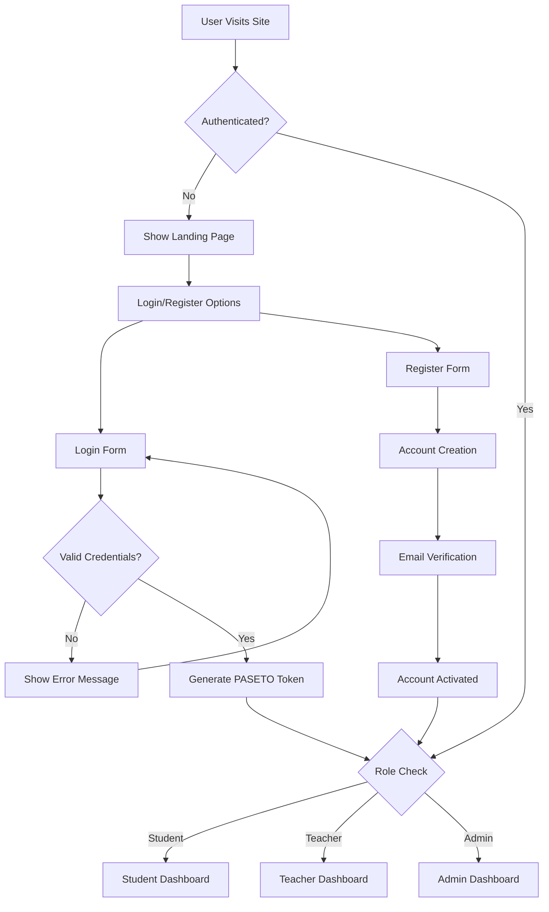
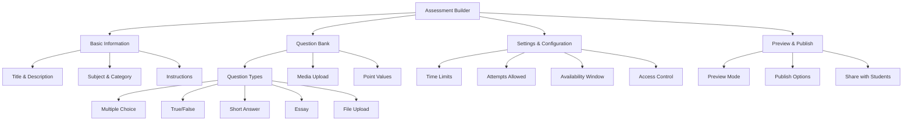

# 🎨 Pediafor Assessment Platform - Frontend

[](.)
[](.)
[](.)
[](.)
[](.)

> **✅ Current Status**
> Frontend scaffold is in place and running with Next.js 15 App Router and React 19. We’ve implemented role-based layouts and a robust assessment-taking flow (sections, timers, autosave, review, forward-only). API integration is the next milestone.

---

## 🚀 Quick Start

### **Current Status**
The frontend compiles and runs. Major UX for the student taking flow is implemented with sample data; API wiring is upcoming.

```bash
# Install dependencies
npm install

# Configure environment
cp .env.example .env.local
# set NEXT_PUBLIC_GATEWAY_URL to your gateway base URL (default http://localhost:3000)
# set NEXT_PUBLIC_REALTIME_URL to your realtime endpoint (e.g., ws://localhost:8080/realtime)
# set NEXT_PUBLIC_AUTH_MODE=mock (default) or api

# Start development server
npm run dev

# Visit http://localhost:3001
```

### **What's Ready**
- ✅ Next.js 15 + React 19 scaffold with Tailwind and TS
- ✅ Role-based layouts (student/teacher/admin) with dummy auth toggle
- ✅ Assessment player: sections, per-section/overall timers, autosave/restore, review modal, forward-only, read-only locked sections, desktop vertical nav
- ✅ Results: `/student/results` list and `/student/results/[id]` detail wired via TanStack Query
- ✅ Realtime: WebTransport primary with WebSocket fallback; results detail auto-refreshes on grading events
- ✅ Submitted confirmation page and .well-known DevTools route

### **What's Coming**
- 🚧 API wiring for auth and student flows (save/submit)
- 🚧 Results integration and teacher/admin data flows
- 🚧 Testing (Jest/Playwright) and lint/format tooling
- 🚧 Realtime updates (WebTransport/WebSocket)

---

## 📋 Table of Contents

1. [Getting Started](#getting-started)
2. [Application Architecture](#application-architecture)
3. [Role-Based Views & Pages](#role-based-views--pages)
4. [Navigation & Menu Strategy](#navigation--menu-strategy)
5. [Branding & Theme System](#branding--theme-system)
6. [Authentication System](#authentication-system)
7. [Assessment Views & Structure](#assessment-views--structure)
8. [API Integration Strategy](#api-integration-strategy)
9. [User Actions Matrix](#user-actions-matrix)
10. [Component Architecture](#component-architecture)
11. [Mobile-First Design](#mobile-first-design)
12. [Footer & Meta Pages](#footer--meta-pages)
13. [Development Roadmap](#development-roadmap)

---

## 🏁 Getting Started

### **Prerequisites**
- Node.js 18+ and npm
- Access to backend API services (see [main README](../README.md))
- Basic familiarity with Next.js 14+ App Router

### **Development Setup**
```bash
# Clone the repository (if not already done)
git clone https://github.com/pediafor/assessment.git
cd assessment/frontend

# Install dependencies
npm install

# Copy environment variables
cp .env.example .env.local
# Edit .env.local with your API endpoints

# Start development server
npm run dev

# Open http://localhost:3001
```

### **Available Scripts**
```bash
npm run dev          # Start development server
npm run build        # Build for production
npm run start        # Start production server
npm run lint         # Run ESLint
npm test             # Run unit tests (Jest)
npm run test:e2e     # Run e2e tests (Playwright)
```

### **Project Structure Overview**
```
frontend/
├── src/
│   ├── app/                 # Next.js 14+ App Router pages
│   ├── components/          # Reusable UI components
│   ├── lib/                 # Utilities and configurations
│   ├── hooks/               # Custom React hooks
│   ├── stores/              # State management (Zustand)
│   ├── types/               # TypeScript definitions
│   └── styles/              # Global styles and Tailwind
├── public/                  # Static assets
├── tests/                   # Test files
└── docs/                    # Additional documentation
```

---

## 🧪 Testing Notes (Docker-backed)

- Backend services use PostgreSQL via Docker for integration tests. Ensure Docker Desktop is running on your machine before executing backend tests.
- To run service tests locally:
  - Start required DB containers per service README (e.g., `docker-compose up -d submission-db`).
  - In each service folder, run `npm ci` and then `npm test`.
- If Docker is not available, tests that depend on Postgres will fail with “Can’t reach database server at localhost:5432”. In that case, skip running those tests until Docker is available.

## 🏗️ Application Architecture

### **Single Page Application (SPA) Structure**

```mermaid
graph TB
    subgraph NextJS["Next.js 14+ App Router"]
        ROOT["Root Layout"]
        AUTH["(auth) Authentication Group"]
        STUDENT["student - Student Routes"]
        TEACHER["teacher - Teacher Routes"] 
        ADMIN["admin - Admin Routes"]
        PUBLIC["public - Landing Pages"]
    end
    
    subgraph AuthFlow["Authentication Flow"]
        LOGIN["Login Page"]
        REGISTER["Register Page"]
        FORGOT["Forgot Password"]
        RESET["Reset Password"]
    end
    
    subgraph StudentDash["Student Dashboard"]
        S_DASH["Dashboard"]
        S_ASSESS["Available Assessments"]
        S_TAKE["Take Assessment"]
        S_RESULTS["My Results"]
        S_PROFILE["Profile Settings"]
    end
    
    subgraph TeacherDash["Teacher Dashboard"]
        T_DASH["Dashboard"]
        T_ASSESS["My Assessments"]
        T_CREATE["Create Assessment"]
        T_GRADE["Grading Center"]
        T_STUDENTS["Student Management"]
        T_ANALYTICS["Analytics"]
    end
    
    subgraph AdminPanel["Admin Panel"]
        A_DASH["System Dashboard"]
        A_USERS["User Management"]
        A_SYSTEM["System Settings"]
        A_REPORTS["System Reports"]
        A_AUDIT["Audit Logs"]
    end
    
    ROOT --> AUTH
    ROOT --> STUDENT
    ROOT --> TEACHER
    ROOT --> ADMIN
    ROOT --> PUBLIC
    
    AUTH --> LOGIN
    AUTH --> REGISTER
    AUTH --> FORGOT
    AUTH --> RESET
    
    STUDENT --> S_DASH
    STUDENT --> S_ASSESS
    STUDENT --> S_TAKE
    STUDENT --> S_RESULTS
    STUDENT --> S_PROFILE
    
    TEACHER --> T_DASH
    TEACHER --> T_ASSESS
    TEACHER --> T_CREATE
    TEACHER --> T_GRADE
    TEACHER --> T_STUDENTS
    TEACHER --> T_ANALYTICS
    
    ADMIN --> A_DASH
    ADMIN --> A_USERS
    ADMIN --> A_SYSTEM
    ADMIN --> A_REPORTS
    ADMIN --> A_AUDIT
```



### **Home Page Strategy**

**Dynamic Home Based on Authentication State:**
- **Unauthenticated Users**: Landing page with platform overview, features, and call-to-action
- **Authenticated Users**: Direct redirect to role-specific dashboard
- **No Generic Dashboard**: Each role gets tailored experience immediately

---

## 👥 Role-Based Views & Pages

### **🔐 Authentication Pages (`/(auth)` group)**

| Page | Route | Purpose | Components |
|------|-------|---------|------------|
| **Login** | `/login` | User authentication | Email/password form, social login options |
| **Register** | `/register` | New user registration | Multi-step form with role selection |
| **Forgot Password** | `/forgot-password` | Password reset request | Email input, verification steps |
| **Reset Password** | `/reset-password` | New password creation | Token verification, password form |
| **Verify Email** | `/verify-email` | Email verification | Verification code input |

### **👨‍🎓 Student Dashboard (`/student`)**

| Page | Route | Purpose | Key Features |
|------|-------|---------|--------------|
| **Dashboard** | `/student` | Student home | Upcoming assessments, recent results, progress overview |
| **Assessments** | `/student/assessments` | Available assessments | Filter by subject, due date, status |
| **Take Assessment** | `/student/assessments/[id]` | Assessment interface | Question navigation, auto-save, timer |
| **Results** | `/student/results` | Past assessments | Grades, feedback, detailed breakdowns |
| **Result Detail** | `/student/results/[id]` | Individual result | Question-by-question review, explanations |
| **Profile** | `/student/profile` | Account settings | Personal info, password change, preferences |
| **Notifications** | `/student/notifications` | System messages | Assessment reminders, grade notifications |

### **👩‍🏫 Teacher Dashboard (`/teacher`)**

| Page | Route | Purpose | Key Features |
|------|-------|---------|--------------|
| **Dashboard** | `/teacher` | Teacher home | Class overview, recent activity, quick actions |
| **Assessments** | `/teacher/assessments` | Assessment management | Create, edit, publish, archive assessments |
| **Create Assessment** | `/teacher/assessments/create` | Assessment builder | Question types, media upload, settings |
| **Edit Assessment** | `/teacher/assessments/[id]/edit` | Assessment editor | Modify existing assessments |
| **Assessment Analytics** | `/teacher/assessments/[id]/analytics` | Performance insights | Class performance, question analysis |
| **Grading Center** | `/teacher/grading` | Grade management | Review submissions, manual grading |
| **Students** | `/teacher/students` | Student management | Class roster, progress tracking |
| **Student Detail** | `/teacher/students/[id]` | Individual student | Performance history, notes |
| **Reports** | `/teacher/reports` | Grade reports | Export capabilities, custom reports |
| **Profile** | `/teacher/profile` | Account settings | Personal info, teaching preferences |

### **🏢 Admin Panel (`/admin`)**

| Page | Route | Purpose | Key Features |
|------|-------|---------|--------------|
| **Dashboard** | `/admin` | System overview | Platform statistics, system health |
| **User Management** | `/admin/users` | User administration | Create, edit, delete users |
| **Create User** | `/admin/users/create` | User creation | Bulk import, individual creation |
| **User Detail** | `/admin/users/[id]` | User management | Edit profile, reset password, permissions |
| **Teachers** | `/admin/teachers` | Teacher management | Teacher-specific administration |
| **Students** | `/admin/students` | Student management | Student-specific administration |
| **System Settings** | `/admin/settings` | Platform configuration | Global settings, feature toggles |
| **Audit Logs** | `/admin/audit` | Security monitoring | User actions, system events |
| **Reports** | `/admin/reports` | System reports | Usage analytics, performance metrics |
| **Health Monitor** | `/admin/health` | System monitoring | Service status, database health |

### **🌐 Public Pages (`/public` or root level)**

| Page | Route | Purpose | Key Features |
|------|-------|---------|--------------|
| **Landing Page** | `/` | Platform introduction | Hero section, features, testimonials |
| **About** | `/about` | Platform information | Mission, team, contact |
| **Features** | `/features` | Feature showcase | Detailed feature explanations |
| **Pricing** | `/pricing` | Pricing plans | Subscription tiers, feature comparison |
| **Contact** | `/contact` | Contact form | Support, sales inquiries |
| **Privacy Policy** | `/privacy` | Legal information | GDPR, FERPA compliance |
| **Terms of Service** | `/terms` | Legal terms | Usage terms, liability |

---

## 🧭 Navigation & Menu Strategy

### **Desktop Navigation (1024px+)**

```
┌─────────────────────────────────────────────────────────────┐
│ [Logo] [Platform Name]           [Search] [Theme] [Profile] │
├─────────────────────────────────────────────────────────────┤
│ [Dashboard] [Main Nav Items] [Secondary Nav] [Quick Actions] │
└─────────────────────────────────────────────────────────────┘
```

**Top Navigation Bar:**
- **Left**: Logo + Platform name
- **Center**: Primary navigation (context-sensitive based on role)
- **Right**: Search, theme toggle, notifications, profile dropdown

**Secondary Navigation:**
- **Breadcrumbs**: Show current location in hierarchy
- **Tab Navigation**: For related pages (e.g., Assessment Details → Analytics → Settings)

### **Mobile Navigation (< 1024px)**

```
┌─────────────────────────────┐
│ [☰] [Logo] [🔍] [👤] [🌙] │
├─────────────────────────────┤
│                             │
│     Slide-out Menu          │
│     ┌─────────────────┐     │
│     │ [Dashboard]     │     │
│     │ [Assessments]   │     │
│     │ [Results]       │     │
│     │ [Profile]       │     │
│     │ [Logout]        │     │
│     └─────────────────┘     │
└─────────────────────────────┘
```

**Mobile Menu Strategy:**
- **Hamburger Menu**: Slide-out navigation drawer
- **Bottom Tab Bar**: Primary actions (Dashboard, Search, Profile, Notifications)
- **Sticky Header**: Logo, menu toggle, essential actions
- **Gesture Support**: Swipe to navigate between related pages

### **Role-Specific Navigation**

**Student Navigation:**
```
Dashboard | Assessments | Results | Profile
```

**Teacher Navigation:**
```
Dashboard | Assessments | Students | Grading | Reports | Profile
```

**Admin Navigation:**
```
Dashboard | Users | Teachers | Students | Settings | Audit | Reports
```

---

## 🎨 Branding & Theme System

### **Design System Foundation**

**Color Palette:**
```css
/* Primary Brand Colors */
--primary-blue: #0066CC
--primary-dark: #004499
--primary-light: #3388DD

/* Semantic Colors */
--success: #10B981
--warning: #F59E0B  
--error: #EF4444
--info: #3B82F6

/* Neutral Colors */
--gray-50: #F9FAFB
--gray-100: #F3F4F6
--gray-500: #6B7280
--gray-900: #111827
```

**Typography:**
```css
/* Font Stack */
--font-primary: 'Inter', system-ui, sans-serif
--font-mono: 'JetBrains Mono', monospace

/* Font Sizes */
--text-xs: 0.75rem
--text-sm: 0.875rem  
--text-base: 1rem
--text-lg: 1.125rem
--text-xl: 1.25rem
--text-2xl: 1.5rem
--text-3xl: 1.875rem
```

### **Dark/Light Mode Toggle**

**Theme Implementation:**
- **System Preference Detection**: Automatically detect user's OS preference
- **Manual Toggle**: Prominent theme switcher in navigation
- **Persistence**: Remember user's choice in localStorage
- **Smooth Transitions**: CSS transitions for theme switching

**Theme Toggle Locations:**
- **Desktop**: Top navigation bar (sun/moon icon)
- **Mobile**: Slide-out menu and settings page
- **Profile Settings**: Theme preference section

**Dark Mode Color Adjustments:**
```css
/* Dark Mode Overrides */
[data-theme="dark"] {
  --bg-primary: #0F172A
  --bg-secondary: #1E293B
  --text-primary: #F8FAFC
  --text-secondary: #CBD5E1
  --border-color: #334155
}
```

### **Responsive Breakpoints**

```css
/* Mobile First Approach */
--mobile: 0px
--tablet: 768px
--desktop: 1024px
--wide: 1280px
--ultra-wide: 1536px
```

---

## 🔐 Authentication System

### **Authentication Flow Diagram**



### **Authentication Pages Design**

**Login Page Layout:**
```
┌─────────────────────────────────┐
│        [Platform Logo]          │
│                                 │
│     Welcome Back                │
│     Sign in to your account     │
│                                 │
│  Email: [________________]      │
│  Password: [____________]       │
│                                 │
│  □ Remember me    Forgot pwd?   │
│                                 │
│       [Sign In Button]          │
│                                 │
│  Don't have account? Sign up    │
│                                 │
│  ─── or continue with ───       │
│  [Google] [Microsoft] [SSO]     │
└─────────────────────────────────┘
```

**Register Page (Multi-Step):**

**Step 1 - Role Selection:**
```
Choose Your Role
○ Student - Take assessments and view results
○ Teacher - Create and grade assessments  
○ Administrator - Manage users and system
```

**Step 2 - Account Details:**
```
Create Your Account
Name: [________________]
Email: [_______________]
Password: [____________]
Confirm: [_____________]
```

**Step 3 - Verification:**
```
Verify Your Email
We sent a code to your email
Enter code: [___________]
```

### **Password Management**

**Admin/Teacher Reset Student Passwords:**
- **Admin Panel**: Bulk password reset capabilities
- **Teacher Panel**: Reset individual student passwords
- **Security**: Require admin/teacher authentication
- **Notification**: Email sent to student with new temporary password

**User Self-Service:**
- **Forgot Password**: Email-based reset flow
- **Password Change**: In profile settings with current password verification
- **Security**: Password strength requirements, history checking

---

## 📝 Assessment Views & Structure

### **Assessment Builder (Teacher)**



**Assessment Builder Interface:**

```
┌─────────────────────────────────────────────────────────────┐
│ Assessment Builder                    [Save Draft] [Preview] │
├─────────────────────────────────────────────────────────────┤
│                                                             │
│ Basic Information                                           │
│ Title: [_____________________________]                     │
│ Description: [_______________________]                     │
│ Subject: [____________] Category: [___]                     │
│                                                             │
│ Questions                                   [+ Add Question] │
│ ┌─────────────────────────────────────────┐                │
│ │ 1. Multiple Choice                  [⚙] │                │
│ │    What is the capital of France?       │                │
│ │    ○ London  ○ Berlin  ● Paris  ○ Rome  │                │
│ │    Points: 5                            │                │
│ └─────────────────────────────────────────┘                │
│                                                             │
│ Settings                                                    │
│ Time Limit: [60] minutes                                   │
│ Attempts: [1] □ Shuffle Questions                          │
│ Available: [Date] to [Date]                                │
│                                                             │
│                            [Cancel] [Save] [Publish]       │
└─────────────────────────────────────────────────────────────┘
```

### **Assessment Taking Interface (Student)**

```
┌─────────────────────────────────────────────────────────────┐
│ Mathematics Quiz - Question 3 of 10        Time: 45:23     │
├─────────────────────────────────────────────────────────────┤
│                                                             │
│ Question 3 (5 points)                                       │
│                                                             │
│ What is the result of 2 + 2?                               │
│                                                             │
│ ○ A) 3                                                      │
│ ○ B) 4                                                      │
│ ○ C) 5                                                      │
│ ○ D) 6                                                      │
│                                                             │
│ [Mark for Review]                                           │
│                                                             │
├─────────────────────────────────────────────────────────────┤
│ Question Navigation                                         │
│ [1] [2] [3] [4] [5] [6] [7] [8] [9] [10]                   │
│                                                             │
│ Legend: [●] Answered [○] Unanswered [⚠] Marked             │
│                                                             │
│                    [Previous] [Save] [Next]                │
│                                                             │
│                      [Submit Assessment]                    │
└─────────────────────────────────────────────────────────────┘
```

**Assessment Features:**
- **Auto-save**: Every 30 seconds and on navigation
- **Question Navigation**: Jump to any question
- **Review Mode**: Mark questions for review
- **Time Management**: Prominent timer with warnings
- **Progress Tracking**: Visual progress indicator
- **Accessibility**: Keyboard navigation, screen reader support

### **Results & Analytics View**

**Student Results:**
```
┌─────────────────────────────────────────┐
│ Mathematics Quiz Results                │
├─────────────────────────────────────────┤
│                                         │
│ Score: 85% (17/20 points)              │
│ Grade: B                                │
│ Time Taken: 42 minutes                  │
│ Submitted: Oct 10, 2025 2:30 PM        │
│                                         │
│ Question Breakdown:                     │
│ ✓ Question 1: Correct (2/2 pts)        │
│ ✗ Question 2: Incorrect (0/2 pts)      │
│ ✓ Question 3: Correct (5/5 pts)        │
│                                         │
│ [View Detailed Feedback]               │
│ [Download Certificate]                  │
└─────────────────────────────────────────┘
```

**Teacher Analytics:**
```
┌─────────────────────────────────────────┐
│ Assessment Analytics                    │
├─────────────────────────────────────────┤
│                                         │
│ Class Performance                       │
│ Average Score: 78%                      │
│ Completion Rate: 95% (19/20)           │
│                                         │
│ [Score Distribution Chart]              │
│ [Question Analysis]                     │
│ [Time Analysis]                         │
│                                         │
│ Difficult Questions:                    │
│ • Question 5: 45% correct               │
│ • Question 8: 52% correct               │
│                                         │
│ [Export Report] [Email Results]        │
└─────────────────────────────────────────┘
```

---

## 🔌 API Integration Strategy

### **REST API Integration**

**State Management with TanStack Query:**
```typescript
// Assessment API Integration
const useAssessments = () => {
  return useQuery({
    queryKey: ['assessments'],
    queryFn: () => apiClient.get('/assessments'),
    staleTime: 5 * 60 * 1000, // 5 minutes
  })
}

// Real-time Updates with Polling
const useAssessmentStatus = (assessmentId: string) => {
  return useQuery({
    queryKey: ['assessment-status', assessmentId],
    queryFn: () => apiClient.get(`/assessments/${assessmentId}/status`),
    refetchInterval: 30000, // Poll every 30 seconds
  })
}
```

**API Client Configuration:**
```typescript
// API Client with Interceptors
const apiClient = axios.create({
  baseURL: process.env.NEXT_PUBLIC_API_URL,
  headers: {
    'Content-Type': 'application/json',
  },
})

// Request Interceptor (Add Auth Token)
apiClient.interceptors.request.use((config) => {
  const token = getAuthToken()
  if (token) {
    config.headers.Authorization = `Bearer ${token}`
  }
  return config
})

// Response Interceptor (Handle Errors)
apiClient.interceptors.response.use(
  (response) => response,
  (error) => {
    if (error.response?.status === 401) {
      // Redirect to login
      router.push('/login')
    }
    return Promise.reject(error)
  }
)
```

### **Event-Driven Updates**

**WebTransport/WebSocket Integration for Real-time Updates:**
```typescript
// Real-time Event Handler with WebTransport primary, WebSocket fallback
const useEventSubscription = () => {
  const queryClient = useQueryClient()
  
  useEffect(() => {
    let transport: WebTransport | WebSocket
    
    // Try WebTransport first (modern browsers)
    if ('WebTransport' in window) {
      transport = new WebTransport(process.env.NEXT_PUBLIC_WT_URL)
      
      transport.ready.then(() => {
        const reader = transport.incomingUnidirectionalStreams.getReader()
        // Handle WebTransport streams
      }).catch(() => {
        // Fallback to WebSocket
        transport = new WebSocket(process.env.NEXT_PUBLIC_WS_URL)
        setupWebSocketHandlers(transport)
      })
    } else {
      // WebSocket fallback for legacy browsers
      transport = new WebSocket(process.env.NEXT_PUBLIC_WS_URL)
      setupWebSocketHandlers(transport)
    }
    
    const setupWebSocketHandlers = (ws: WebSocket) => {
      ws.onmessage = (event) => {
        const { type, data } = JSON.parse(event.data)
        
        switch (type) {
          case 'submission.submitted':
            queryClient.invalidateQueries(['submissions'])
            break
          case 'grading.completed':
            queryClient.invalidateQueries(['results'])
            break
          case 'assessment.updated':
            queryClient.invalidateQueries(['assessments'])
            break
        }
      }
    }
    
    return () => {
      if (transport instanceof WebTransport) {
        transport.close()
      } else {
        transport.close()
      }
    }
  }, [queryClient])
}
```

**Manual Override vs Automated Actions:**
- **Manual Actions**: Direct API calls with immediate UI feedback
- **Automated Actions**: Event-driven updates with optimistic UI
- **Conflict Resolution**: Handle race conditions between manual and automated updates

---

## 👤 User Actions Matrix

### **Student Actions**

| Action | API Endpoint | Page/Component | Permissions | Events Triggered |
|--------|-------------|----------------|-------------|------------------|
| **View Assessments** | `GET /assessments?status=PUBLISHED` | Dashboard, Assessments | Student | None |
| **Start Assessment** | `POST /submissions` | Assessment Detail | Student | `submission.started` |
| **Save Answer** | `POST /submissions/:id/answers` | Assessment Taking | Student | `answer.saved` |
| **Submit Assessment** | `POST /submissions/:id/submit` | Assessment Taking | Student | `submission.submitted` |
| **View Results** | `GET /submissions` and `GET /submissions/:id` | Results | Student | None |
| **Update Profile** | `PUT /users/profile` | Profile | Student | `user.updated` |
| **Change Password** | `PUT /users/password` | Profile | Student | `password.changed` |

### **Teacher Actions**

| Action | API Endpoint | Page/Component | Permissions | Events Triggered |
|--------|-------------|----------------|-------------|------------------|
| **Create Assessment** | `POST /assessments` | Assessment Builder | Teacher | `assessment.created` |
| **Publish Assessment** | `PUT /assessments/:id/publish` | Assessment Builder | Teacher | `assessment.published` |
| **Grade Submission** | `PUT /submissions/:id/grade` | Grading Center | Teacher | `grading.completed` |
| **View Analytics** | `GET /assessments/:id/analytics` | Analytics | Teacher | None |
| **Manage Students** | `GET /users?role=student` | Students | Teacher | None |
| **Reset Student Password** | `PUT /users/:id/reset-password` | Student Detail | Teacher | `password.reset` |
| **Export Results** | `GET /assessments/:id/export` | Analytics | Teacher | None |

### **Admin Actions**

| Action | API Endpoint | Page/Component | Permissions | Events Triggered |
|--------|-------------|----------------|-------------|------------------|
| **Create User** | `POST /users` | User Management | Admin | `user.created` |
| **Delete User** | `DELETE /users/:id` | User Management | Admin | `user.deleted` |
| **Bulk Create Students** | `POST /users/bulk` | User Management | Admin | `users.bulk_created` |
| **System Settings** | `PUT /system/settings` | Settings | Admin | `system.updated` |
| **View Audit Logs** | `GET /audit-logs` | Audit | Admin | None |
| **System Health** | `GET /health` | Health Monitor | Admin | None |

### **Permission Matrix**

```
Action Type         | Student | Teacher | Admin
--------------------|---------|---------|-------
View Own Data       |    ✓    |    ✓    |   ✓
View Student Data   |    ✗    |    ✓    |   ✓
Modify Student Data |    ✗    |    ✗    |   ✓
Create Assessments  |    ✗    |    ✓    |   ✓
Grade Assessments   |    ✗    |    ✓    |   ✓
System Settings     |    ✗    |    ✗    |   ✓
User Management     |    ✗    |    ✗    |   ✓
Audit Logs          |    ✗    |    ✗    |   ✓
```

---

## 🧩 Component Architecture

### **Component Hierarchy**

```
src/
├── app/                          # Next.js App Router
│   ├── layout.tsx               # Root layout with providers
│   ├── page.tsx                 # Landing page
│   ├── (auth)/                  # Authentication group
│   ├── student/                 # Student routes
│   ├── teacher/                 # Teacher routes
│   └── admin/                   # Admin routes
├── components/
│   ├── ui/                      # Base UI components (shadcn/ui)
│   │   ├── button.tsx
│   │   ├── input.tsx
│   │   ├── card.tsx
│   │   └── ...
│   ├── forms/                   # Form components
│   │   ├── login-form.tsx
│   │   ├── assessment-form.tsx
│   │   └── user-form.tsx
│   ├── layout/                  # Layout components
│   │   ├── header.tsx
│   │   ├── sidebar.tsx
│   │   ├── navigation.tsx
│   │   └── footer.tsx
│   └── features/                # Feature-specific components
│       ├── assessment/
│       ├── grading/
│       └── analytics/
├── lib/                         # Utilities and configurations
├── hooks/                       # Custom React hooks
├── stores/                      # Zustand stores
└── types/                       # TypeScript definitions
```

### **Key Component Patterns**

**Layout Components:**
```typescript
// Root Layout
export default function RootLayout({
  children,
}: {
  children: React.ReactNode
}) {
  return (
    <html lang="en">
      <body>
        <Providers>
          <Header />
          <main>{children}</main>
          <Footer />
        </Providers>
      </body>
    </html>
  )
}

// Role-specific Layout
export default function StudentLayout({
  children,
}: {
  children: React.ReactNode
}) {
  return (
    <div className="min-h-screen bg-gray-50">
      <StudentNavigation />
      <div className="lg:pl-64">
        <main className="py-10">
          <div className="px-4 sm:px-6 lg:px-8">
            {children}
          </div>
        </main>
      </div>
    </div>
  )
}
```

**Form Components:**
```typescript
// Assessment Form with Validation
interface AssessmentFormProps {
  assessment?: Assessment
  onSubmit: (data: AssessmentData) => void
}

export function AssessmentForm({ assessment, onSubmit }: AssessmentFormProps) {
  const form = useForm<AssessmentData>({
    resolver: zodResolver(assessmentSchema),
    defaultValues: assessment || {},
  })

  return (
    <Form {...form}>
      <form onSubmit={form.handleSubmit(onSubmit)}>
        <FormField
          control={form.control}
          name="title"
          render={({ field }) => (
            <FormItem>
              <FormLabel>Title</FormLabel>
              <FormControl>
                <Input {...field} />
              </FormControl>
              <FormMessage />
            </FormItem>
          )}
        />
        {/* More fields... */}
        <Button type="submit">Save Assessment</Button>
      </form>
    </Form>
  )
}
```

---

## 📱 Mobile-First Design

### **Responsive Breakpoints Strategy**

```css
/* Mobile First Approach */
.component {
  /* Mobile styles (default) */
  padding: 1rem;
  
  /* Tablet */
  @media (min-width: 768px) {
    padding: 1.5rem;
  }
  
  /* Desktop */
  @media (min-width: 1024px) {
    padding: 2rem;
  }
}
```

### **Mobile Navigation Patterns**

**Bottom Tab Navigation (Mobile):**
```
┌─────────────────────────────┐
│                             │
│        Main Content         │
│                             │
│                             │
├─────────────────────────────┤
│ [🏠] [📝] [📊] [👤] [⚙️] │
│ Home  Test  Results Profile │
└─────────────────────────────┘
```

**Slide-out Menu (Mobile):**
```
┌─────────────────────────────┐
│ ☰ Platform Name      [👤]  │
├─────────────────────────────┤
│ ┌─────────────────┐         │
│ │ Dashboard       │ Content │
│ │ Assessments     │         │
│ │ Results         │         │
│ │ ───────────     │         │
│ │ Profile         │         │
│ │ Settings        │         │
│ │ Logout          │         │
│ └─────────────────┘         │
└─────────────────────────────┘
```

### **Touch-Friendly Design**

**Minimum Touch Targets:**
- **Buttons**: 44px minimum height/width
- **Links**: 44px minimum touch area
- **Form Inputs**: 44px minimum height
- **Navigation Items**: 48px minimum height

**Gesture Support:**
- **Swipe Navigation**: Between assessment questions
- **Pull to Refresh**: On data lists
- **Pinch to Zoom**: On assessment images
- **Long Press**: Context menus

---

## 🦶 Footer & Meta Pages

### **Footer Design**

```
┌─────────────────────────────────────────────────────────────┐
│                                                             │
│ Pediafor Assessment Platform                                │
│                                                             │
│ Product          Support          Company                   │
│ Features         Help Center      About Us                  │
│ Pricing          Documentation    Careers                   │
│ API Docs         Contact          Blog                      │
│                                                             │
│ Legal            Social                                     │
│ Privacy Policy   Twitter                                    │
│ Terms of Service GitHub                                     │
│ Cookie Policy    LinkedIn                                   │
│                                                             │
│ © 2025 Pediafor. All rights reserved.                      │
│                                                             │
└─────────────────────────────────────────────────────────────┘
```

### **Meta Pages**

**Privacy Policy Page:**
- GDPR compliance information
- FERPA compliance for educational data
- Data collection and usage policies
- User rights and data control options

**Terms of Service:**
- Platform usage terms
- User responsibilities
- Service availability and limitations
- Liability and warranty disclaimers

**Accessibility Statement:**
- WCAG 2.1 AA compliance commitment
- Accessibility features description
- Contact information for accessibility issues
- Regular audit and improvement process

**Help Center:**
- Searchable knowledge base
- Role-specific help sections
- Video tutorials and guides
- FAQ sections

---

## 🚀 Development Roadmap

### **Phase 1: Foundation (Weeks 1-2)**
- ✅ Project structure and configuration
- 🚧 Authentication system (login/register/forgot password)
- 🚧 Base UI components (shadcn/ui integration)
- 🚧 Layout components (header, navigation, footer)
- 🚧 Theme system (dark/light mode)

### **Phase 2: Student Experience (Weeks 3-4)**
- 📝 Student dashboard
- 📝 Assessment listing and filtering
- 📝 Assessment taking interface
- 📝 Results viewing
- 📝 Profile management

### **Phase 3: Teacher Experience (Weeks 5-6)**
- 📝 Teacher dashboard
- 📝 Assessment builder
- 📝 Student management
- 📝 Grading interface
- 📝 Analytics dashboard

### **Phase 4: Admin Experience (Weeks 7-8)**
- 📝 Admin dashboard
- 📝 User management
- 📝 System settings
- 📝 Audit logs
- 📝 System monitoring

### **Phase 5: Polish & Optimization (Weeks 9-10)**
- 📝 Mobile optimization
- 📝 Performance optimization
- 📝 Accessibility improvements
- 📝 Testing and bug fixes
- 📝 Documentation

---

## 📋 Additional Considerations & Missing Elements

### **Internationalization (i18n)**
- Multi-language support preparation
- RTL language support
- Cultural considerations for date/time formats
- Localized content management

### **Offline Support**
- Service worker implementation
- Offline assessment taking capability
- Data synchronization when online
- Offline indicators and messaging

### **Progressive Web App (PWA)**
- App manifest configuration
- Install prompts
- Push notifications
- App icon and splash screens

### **Accessibility Features**
- Screen reader optimization
- Keyboard navigation
- High contrast mode
- Font size adjustment
- Focus management

### **Performance Monitoring**
- Real User Monitoring (RUM)
- Core Web Vitals tracking
- Error boundary implementation
- Performance budgets

### **Security Features**
- Content Security Policy (CSP)
- XSS protection
- CSRF protection
- Audit logging for sensitive actions

### **Advanced Features for Future**
- Real-time collaborative editing
- Voice/video integration for oral assessments
- AI-powered question suggestions
- Advanced analytics and insights
- LMS integration plugins

---

## 🎯 Success Criteria

### **User Experience Goals**
- **Page Load Time**: < 2 seconds on 3G connection
- **Accessibility Score**: WCAG 2.1 AA compliance (100%)
- **Mobile Usability**: Google Mobile-Friendly test pass
- **User Satisfaction**: > 4.5/5 rating in user testing

### **Technical Goals**
- **Test Coverage**: > 80% unit test coverage
- **Performance Score**: > 90 Lighthouse performance score
- **SEO Score**: > 95 Lighthouse SEO score
- **Bundle Size**: < 1MB initial bundle size

### **Business Goals**
- **User Adoption**: Seamless migration from API-only usage
- **Feature Parity**: 100% backend feature coverage in UI
- **Conversion Rate**: Increase user engagement by 40%
- **Retention Rate**: Improve user retention by 25%

---

## 🤝 Contributing to Frontend Development

### **Current Development Focus**
We're in **Phase 1** of frontend development, focusing on:
- 🔐 Authentication system implementation
- 🎨 Base UI components (shadcn/ui integration)
- 🧭 Layout components (header, navigation, footer)
- 🌙 Theme system (dark/light mode)

### **How to Contribute**
1. **Check the [Development Roadmap](#development-roadmap)** for current priorities
2. **Follow the architecture patterns** outlined in this document
3. **Use TypeScript** for all new code with proper type definitions
4. **Follow accessibility guidelines** (WCAG 2.1 AA)
5. **Test your changes** across different screen sizes and devices

### **Code Style & Standards**
- **ESLint & Prettier**: Configured and enforced
- **Component Patterns**: Follow examples in [Component Architecture](#component-architecture)
- **File Naming**: kebab-case for files, PascalCase for components
- **Import Order**: External libraries → Internal modules → Relative imports

### **Useful Resources**
- [Next.js 14 Documentation](https://nextjs.org/docs)
- [shadcn/ui Components](https://ui.shadcn.com/docs)
- [Tailwind CSS](https://tailwindcss.com/docs)
- [Backend API Documentation](../docs/api.md)

---

## 📚 Additional Documentation

- **[Main Project README](../README.md)**: Complete platform overview
- **[Backend API Docs](../docs/api.md)**: REST API reference
- **[Architecture Docs](../docs/architecture.md)**: System architecture
- **[Contributing Guide](../CONTRIBUTING.md)**: General contribution guidelines

---

*This README serves as our living development blueprint. As we implement features, we'll update this document to reflect the current state and any architectural decisions or changes.*